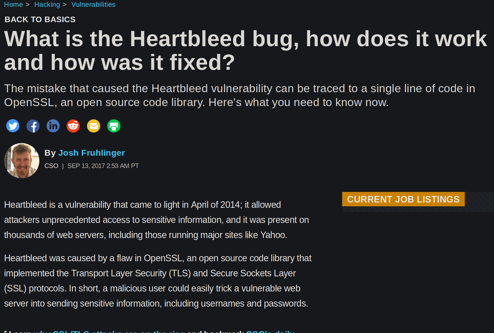
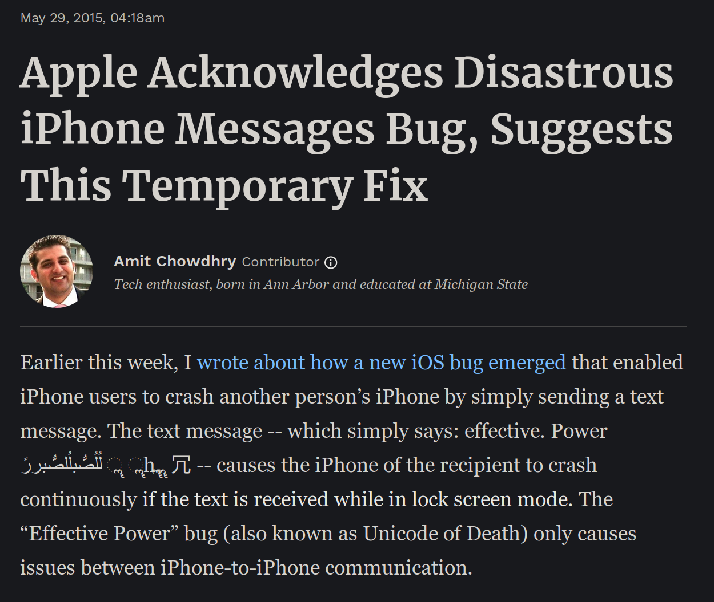
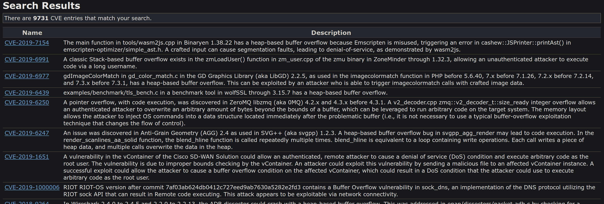

---
title:
- The Rust Programming Language
author:
- Ben Goldberg
theme:
- dark
---

# Rust

A Programming Language for the Future

# Overview

- The sales pitch
- Use cases
- The Rust language

# Other Languages

What's wrong with other languages?

# Other Languages: Python

What's wrong with Python?

# Other Languages: Python

- Slow
- Heavy
- Doesn't catch mistakes

# Other Languages: C/C++

What's wrong with C/C++?

# Other Languages: C/C++

- Memory Leaks
- Buffer overflow
- Use after free
- Double free
- Null pointer dereference
- Read uninitialized memory
- Race conditions
- No good build tools for large projects

# Other Languages: C/C++



# Other Languages: C/C++


# Other Languages: C/C++



# Other Languages: C/C++



# What do we want?

We want to write performant and reliable programs easily and productively

# Comparison


# What is Rust?

What does rust-lang.org say about Rust?

# Performance

Rust is blazingly fast and memory-efficient: with no runtime or garbage collector, it can power performance-critical services, run on embedded devices, and easily integrate with other languages.

# Reliability

Rust’s rich type system and ownership model guarantee memory-safety and thread-safety — and enable you to eliminate many classes of bugs at compile-time.

# Productivity

Rust has great documentation, a friendly compiler with useful error messages, and top-notch tooling — an integrated package manager and build tool, smart multi-editor support with auto-completion and type inspections, an auto-formatter, and more.

# Use Cases

- Command line tools
- Operating systems
- Network services
- Webasmbily
- Embedded

# Things Written in Rust

- Servo/parts of Firefox
- Redox
- Ripgrep
- Dropbox's storage backend
- Many more...

# The Language

Read the Rust Book

https://doc.rust-lang.org/book/

The Rust Playground

https://play.rust-lang.org/

Some examples from the rust book

# Hello World

```rust
fn main() {
    println!("Hello, world!");
}
```

# Immutable by default

## All variables are immutable by default

Doesn't work

```rust
let x = 5;
x = 3;
```

Works

```rust
let mut x = 5;
x = 3;
```

# Static Typing

## All variables must have one type

```rust
let x: i32 = 77;
```

## But with type inference

```rust
let x = 77;
```

# Rust's Core Principle

Aliasing XOR Mutation

# Ownership

## Ownership rules

- Each value in Rust has a variable that’s called its owner
- There can only be one owner at a time
- When the owner goes out of scope, the value will be dropped

```rust
fn main() {
    let x = 1;
    {
        let y = 5;
        println!("x:{}, y:{}", x, y);
    }
    println!("x:{}, y:{}", x, y);
}
```

# Another Example

```rust
fn hello(name: String) {
    println!("Hello {}!", name);
}

fn main() {
    let name = String::from("RIT LUG");
    hello(name);
    println!("Goodbye {}", name);
}
```

# References and Borrowing

We can lend out ownership of a value with a reference

```rust
fn hello(name: &String) {
    println!("Hello {}!", name);
}

fn main() {
    let name = String::from("RIT LUG");
    hello(&name);
    println!("Goodbye {}", name);
}
```

# Immutable vs Mutable References

## Immutable reference

```rust
fn inc(x: &i32) {
    x += 1;
}
```

## Mutable reference

```rust
fn inc(x: &mut i32) {
    x += 1;
}
```

```rust
fn main() {
    let mut x = 1;
    inc(&mut x);
}
```

# Immutable vs Mutable References cont.

Aliasing or Mutability

```rust
let mut v1 = 3;
let r1 = &v1;
let r2 = &v1;

let mut v2 = 4;
let r1 = &mut v2;
let r2 = &mut v2;
```

# Functions

```rust
fn hello() {
    println!("Hello");
}

fn add(x: i32, y: i32) -> i32 {
    x + y
}
```

# Structures

```rust
struct Person {
    name: String,
    age: u16,
}

let person = Person {
    name: String::from("Greg"),
    age: 32,
};
```

# Methods

```rust
struct Point {
    x: i32,
    y: i32,
}

impl Point {
    fn new(x: i32, y: i32) -> Point {
        Point {
            x,
            y,
        }
    }
}
```

# Methods cont.

```rust
impl Point {
    fn add(&mut self, other: &Point) {
        self.x += other.x;
        self.y += other.y;
    }
}

fn main() {
    let p1 = Point::new(1, 2);
    let p2 = Point::new(2, 3);
    p1.add(&p2);
}
```

# Strings

Two types of strings

## String slice

&str

```rust
let s1 = "Hello";
```

## Owned string

String

```rust
let s1 = String::from("Hello");
let s2 = "World".to_owned();
let s3 = String::from("Foo").push_str("Bar");
```

# Unit Type

`()` equivalent to `void` in C

# Enums

```rust
enum Direction {
    Left,
    Right,
}

enum IpAddr {
    V4(u8, u8, u8, u8),
    V6(String),
}
```

# Matching

```rust
enum Coin {
    Penny,
    Nickel,
    Dime,
    Quarter,
}

fn value_in_cents(coin: Coin) -> u32 {
    match coin {
        Coin::Penny => 1,
        Coin::Nickel => 5,
        Coin::Dime => 10,
        Coin::Quarter => 25,
    }
}
```

# Matching cont.

```rust
enum Coin {
    Penny,
    Nickel,
    Dime,
    Quarter,
}

fn is_a_penny(coin: Coin) -> bool {
    match coin {
        Coin => {
            println!("A penny!");
            true
        }
        _ => false,
    }
}
```

# Matching cont. 2

```rust
enum IpAddr {
    V4(u8, u8, u8, u8),
    V6(String),
}

match ip_addr {
    IpAddr::V4(p1, p2, p3, p4) => println!("{}.{}.{}.{}.", p1, p2, p3, p4),
    IpAddr::V6(s) => println!("{}", s),
}
```

# If-let

```rust
match ip_addr {
    IpAddr::V6(s) => println!("{}", s),
    _ => (),
}


if let IpAddr::V6(s) = ip_addr {
    println!("{}", s);
}
```

# Panic

```rust
fn main() {
    panic!("crash and burn");
}
```

``` rust
fn main() {
    let v = vec![1, 2, 3];

    v[99];
}
```

# Result

```rust
enum Result<T, E> {
    Ok(T),
    Err(E),
}
```

# Result Ex.

```rust
use std::fs::File;

fn main() {
    let f = File::open("hello.txt");

    let f = match f {
        Ok(file) => file,
        Err(error) => {
            panic!("There was a problem opening the file: {:?}", error)
        },
    };
}
```

# Result Ex. cont.

```rust
use std::fs::File;

fn main() {
    let f = File::open("hello.txt").unwrap();
}
```

# Propagate Errors

```rust
use std::io;
use std::io::Read;
use std::fs::File;

fn read_username_from_file() -> Result<String, io::Error> {
    let f = File::open("hello.txt");

    let mut f = match f {
        Ok(file) => file,
        Err(e) => return Err(e),
    };

    let mut s = String::new();

    match f.read_to_string(&mut s) {
        Ok(_) => Ok(s),
        Err(e) => Err(e),
    }
}
```

# Propagate Errors cont.

```rust
use std::io;
use std::io::Read;
use std::fs::File;

fn read_username_from_file() -> Result<String, io::Error> {
    let mut f = File::open("hello.txt")?;
    let mut s = String::new();
    f.read_to_string(&mut s)?;
    Ok(s)
}
```

# Option

```rust
enum Option<T> {
    Some(T),
    None,
}
```

# Generics

```rust
struct Point<T> {
    x: T,
    y: T,
}

impl<T> Point<T> {
    fn x(&self) -> &T {
        &self.x
    }
}

fn main() {
    let p = Point { x: 5, y: 10 };

    println!("p.x = {}", p.x());
}
```

# Traits

```rust
trait MakeSound {
    fn make_sound() -> String;
}

struct Dog;

impl MakeSound for Dog {
    fn make_sound() -> String {
        String::from("bark!")
    }
}
```

# Traits in Generics

```rust
fn are_equal<T: Eq>(x: T, y: T) -> bool {
    x == y
}
```

# Borrow Checker

```rust
{
    let r;                // ---------+-- 'a
                          //          |
    {                     //          |
        let x = 5;        // -+-- 'b  |
        r = &x;           //  |       |
    }                     // -+       |
                          //          |
    println!("r: {}", r); //          |
}
```

# Borrow Checker cont.

```rust
{
    let x = 5;            // ----------+-- 'b
                          //           |
    let r = &x;           // --+-- 'a  |
                          //   |       |
    println!("r: {}", r); //   |       |
                          // --+       |
}
```

# Lifetimes

```rust
fn longest(x: &str, y: &str) -> &str {
    if x.len() > y.len() {
        x
    } else {
        y
    }
}
```

```rust
fn longest<'a>(x: &'a str, y: &'a str) -> &'a str {
    if x.len() > y.len() {
        x
    } else {
        y
    }
}
```

# Lifetimes cont.

```rust
fn main() {
    let string1 = String::from("long string is long");

    {
        let string2 = String::from("xyz");
        let result = longest(string1.as_str(), string2.as_str());
        println!("The longest string is {}", result);
    }
}
```

# Lifetimes cont. 2

```rust
fn main() {
    let string1 = String::from("long string is long");
    let result;
    {
        let string2 = String::from("xyz");
        result = longest(string1.as_str(), string2.as_str());
    }
    println!("The longest string is {}", result);
}
```

# Modules

```rust
mod sound {
    mod instrument {
        mod woodwind {
            fn clarinet() {
                // Function body code goes here
            }
        }
    }

    mod voice {

    }
}

fn main() {

}
```

# Modules cont.

```rust
pub mod sound {
    pub mod instrument {
        pub fn clarinet() {
            // Function body code goes here
        }
    }
}

fn main() {
    // Absolute path
    crate::sound::instrument::clarinet();

    // Relative path
    sound::instrument::clarinet();
}
```

# Modules cont. 2

```rust
pub struct Point {
    pub x: i32,
    pub y: i32,
}
```

# Cargo

The best build tool

- Build all of your code with out of the box
- Pull in all dependencies with no headaches
- It just works!

# Resources

- The Rust website: [https://www.rust-lang.org/](https://www.rust-lang.org/)
- The Rust book: [https://doc.rust-lang.org/book/](https://doc.rust-lang.org/book/)
- The Rust playground [https://play.rust-lang.org/](https://play.rust-lang.org/)
- Rust by example: [https://github.com/rust-lang/rust-by-example](https://github.com/rust-lang/rust-by-example)